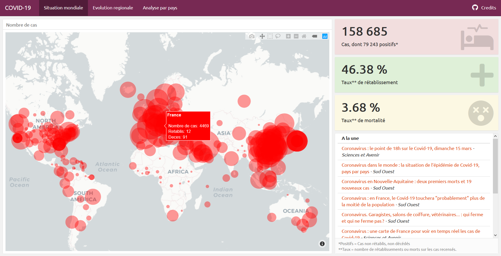
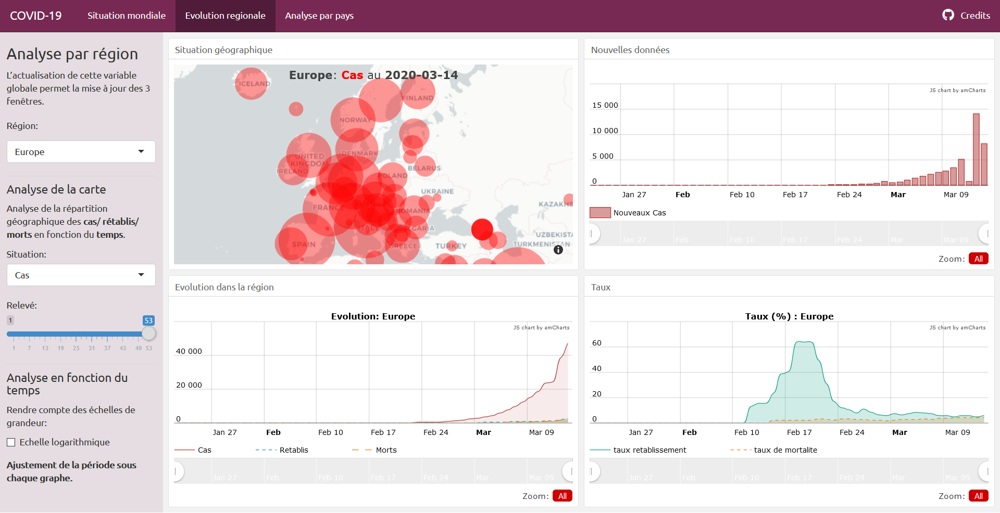

```{r setup, include=FALSE}
source("Dashboard/scripts/global.R")
options(warn=-1)
```

Ces applications traitent des données du Coronavirus COVID-19.  

## Liens des applications
- [**COVID-19 Dashboard**](https://lrakotoson.shinyapps.io/Covid-19/)
- [**Shiny App Analysis**](https://lena35.shinyapps.io/Application_Shiny_Coronavirus/)

## Les données
### Tables principales
Les 3 tables de base (**Cas**, **Rétablis**, **Morts**) sur lequel nous travaillons possèdent la même structure. L'évolution des statistiques pour chaque pays pour chaque jour depuis le 22 Janvier 2020, en plus des coordonées GPS.  
Une colonne s'ajoute chaque jour, une ligne s'ajoute pour un nouvel Etat touché.  
Après netoyage, voici les premières lignes de la table **Cas**:
```{r message=FALSE}
head(T_cas)
```

### Tables calculées
#### Latest
La fonction `latest(t)` renvoie les données pour le t-eme relevé en aggrégeant les trois tables. Par défaut les données les plus récentes sont renvoyées. La fonction `continent()` ajoute la colonne *Continent*.  
`t` suit le numero de relevé de l'OMS.  
Les premières lignes:
```{r}
head(latest())
```


#### Brief  
La fonction `brief(group, t)` renvoie les données du t-eme relevé pour chaque groupe (Continent ou Pays). Par défaut les données les plus récentes pour le Monde sont renvoyées.  
Les premières lignes:
```{r}
brief()
```

#### Actus
La fonction `actus(rows)` renvoie les rows-er infos les plus récentes dans la presse française. Les données en entrée sont en XML et sortent en tible d'une colonne formaté avec des liens de redirection.  
Les premières lignes:
```{r}
head(actus())
```

<hr>

# COVID-19 Dashboard
Le Dashboard permet de visualiser l'évolution du Coronavirus en temps réel dans l'espace et le temps.  
Il contient deux onglets pour visualiser la situation mondiale et pour chaque région du globe.  

Nous l'avons mis en production directement le 25 Février 2020 face à l'urgence de la situation afin qu'on puisse s'informer et suivre l'évolution de la situation.

## Situation Mondiale
Cette page est subdivisée en trois parties: l'évolution géographique, les dernières données et les actualités à la Une.

<figure align="center">

<figcaption align="right"> Capture écran du 01 Mars 2020 </figcaption>
</figure>
<br>

### Evolution géographique
Nous voulons présenter la répartition géographique du nombre de cas dans le Monde avec les données les plus récentes.  
En survolant, on peut obtenir pour chaque Etat, le nombre de cas, de rétablissements et de décès depuis le début de la pandémie.

### Dernières données
Nous resumons dans cette partie:

- Le nombre total de cas recencés, dont les cas toujours actifs
- Le taux de rétablissement
- Le taux de létalité

### Dernières infos
Comme nos données se mettent à jour quotidiennement, les données évoluent entre temps.  
Cette section permet de suivre en temps réel les articles de presse et les dépèches pour connaître les actualités à la Une.

## Evolution Regionale
Cette page permet d'analyser de façon plus précise chaque région du globe en fonction du temps.

<figure align="center">

<figcaption align="right"> Capture écran du 01 Mars 2020 </figcaption>
</figure>
<br>

Elle est divisée en 4 parties:

- **Situation géographique**: représentation de la répartition des Cas / Morts / Rétablis dans la région sélectionnée et au t-ème relevé de l'OMS.
- **Nouvelles données**: évolution du nombre de nouveaux Cas / Morts / Rétablis dans la région sélectionnée.
- **Evolution dans la région**: évolution des cumuls des Cas, Morts et Rétablis dans la région. Le curseur permet de zoomer sur une période précise.
- **Taux**: évolution des taux de rétablissement et de létalité dans la région sélectionnée. Le curseur permet de zoomer pour se concentrer sur une période.

La barre de contrôle permet de piloter l'analyse en spécifiant:

- La région à analyser pour les 4 subdivisions
- La situation à représenter sur les 2 subdivisions de la première ligne
- Les données du t-ème relevé de l'OMS à représenter sur la carte
- La représentation à l'échelle logarithmique ou non de l'évolution dans la région

<hr>

# Shiny App Analysis
L'application Shiny permet d'effectuer l'analyse d'une des 3 situations dans une période donnée ainsi que la comparaison de la situation entre deux pays.  
Elle contient alors 3 onglet en plus des données.

<hr>

## Sources des données
Les données proviennent de divers sources dont l'[OMS](https://www.who.int/emergencies/diseases/novel-coronavirus-2019/situation-reports/), 
les [rapports quotidiens](http://www.nhc.gov.cn/yjb/pzhgli/new_list.shtml) 
du gouvernement Chinois et les CDC de différents gouvernements ([Etats-Unis](https://www.cdc.gov/coronavirus/2019-ncov/index.html), 
[Canada](https://www.canada.ca/en/public-health/services/diseases/coronavirus.html), 
[EU](https://www.ecdc.europa.eu/en/geographical-distribution-2019-ncov-cases), 
[Italie](http://www.salute.gov.it/nuovocoronavirus), 
[Australie](https://www.health.gov.au/news/coronavirus-update-at-a-glance), 
[Taiwan](https://sites.google.com/cdc.gov.tw/2019ncov/taiwan?authuser=0), 
[Chine](http://weekly.chinacdc.cn/news/TrackingtheEpidemic.htm), 
[Singapour](https://www.moh.gov.sg/covid-19)).

Les trois jeux de données en CSV, traduites en anglais et aggrégées pour les Cas, les Rétablis et les Morts proviennent du CSSE de l'[Université de Johns Hopkins](https://systems.jhu.edu/) qui les met à jour pour $j-1$.

Les flux RSS proviennent des *Google Actus* en XML.